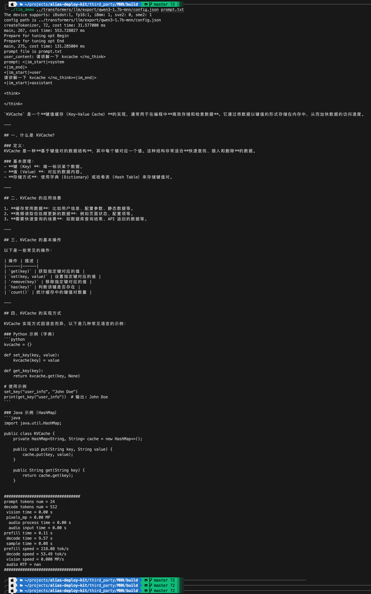

# alias-deploy-kit

[TOC]

## Environment

gcc, cmake
Mac, Linux, WSL

## Document

https://mnn-docs.readthedocs.io/en/latest/transformers/llm.html

## Basic process (Desktop)

### 1. Build

```bash
cd MNN
rm -rf build
mkdir build
cd build

cmake -DMNN_BUILD_LLM=ON -DMNN_BUILD_LLM_OMNI=ON -DMNN_BUILD_CONVERTER=ON ..

make -j8
```

### 2. Export model

```bash
cd MNN/transformers/llm/export

pip install -r requirements.txt

modelscope download Qwen/Qwen3-1.7B --local_dir outputs/Qwen3-1.7B

python llmexport.py --path outputs/Qwen3-1.7B --dst_path outputs/qwen3-1.7b-mnn --export mnn --hqq
```

### 3. Run demo

```bash
cd MNN/build
echo "请介绍一下你自己" > prompt.txt
echo "请讲解一下 kvcache </no_think>" > prompt.txt
./llm_demo ../transformers/llm/export/outputs/qwen3-1.7b-mnn/config.json prompt.txt

# Multimodal input format:
# demo.jpg</img> 请介绍一下图片内容
```

### 4. Result



## Basic process (Android)

### 1. Build

```bash
# compile mnn main library
cd MNN/project/android
mkdir build_64
cd build_64
../build_64.sh "-DMNN_LOW_MEMORY=true -DMNN_CPU_WEIGHT_DEQUANT_GEMM=true -DMNN_BUILD_LLM=true -DMNN_SUPPORT_TRANSFORMER_FUSE=true -DMNN_ARM82=true -DMNN_USE_LOGCAT=true -DMNN_OPENCL=true -DLLM_SUPPORT_VISION=true -DMNN_BUILD_OPENCV=true -DMNN_IMGCODECS=true -DLLM_SUPPORT_AUDIO=true -DMNN_BUILD_AUDIO=true -DMNN_BUILD_DIFFUSION=ON -DMNN_SEP_BUILD=OFF -DCMAKE_SHARED_LINKER_FLAGS='-Wl,-z,max-page-size=16384' -DCMAKE_INSTALL_PREFIX=."
make install

# compile & install android app
cd MNN/apps/Android/MnnLlmChat
./installDebug.sh

# push model to device
cd MNN/transformers/llm/export
adb devices
adb shell mkdir -p /data/local/tmp/mnn_models
adb push outputs/qwen3-1.7b-mnn /data/local/tmp/mnn_models/
# mirror device
scrcpy
```

## Optimized process

### 1. Install basic dependencies

```bash
sudo apt-get update && sudo apt-get install -y cmake build-essential git python3-pip

python -m venv venv

pip install -r requirements.txt
```

### 2. Run prune script

```bash
python prune_qwen3.py
```

### 3. Export target model (NPU) using llmexport (Sparse + Int4)

```bash
python llmexport.py \
    --path ./outputs/models/qwen3-1.7b-sparse-2by4 \
    --mnn_model_name qwen3_4b_sparse_w4.mnn \
    --export_mnn \
    --quant_bit 4 \
    --quant_block 128 \
    --dhm_model
```

### 4. Export draft model (CPU) using llmexport

```bash
python llmexport.py \
    --path Qwen/Qwen2.5-0.5B \
    --mnn_model_name qwen2.5_0.5b_w4.mnn \
    --export_mnn \
    --quant_bit 4
```

### 5. Compile MNN engine (with QNN backend)

Prepare Android NDK & Qualcomm QNN SDK

- Android NDK: NDK r25c or r26b
- Qualcomm AI Engine Direct (QNN) SDK

```bash
export ANDROID_NDK=/path/to/android-ndk
export QNN_SDK_ROOT=/opt/qcom/qnn-sdk

cd MNN
rm -rf build
mkdir build
cd build

cmake.. \
    -DCMAKE_TOOLCHAIN_FILE=$ANDROID_NDK/build/cmake/android.toolchain.cmake \
    -DCMAKE_BUILD_TYPE=Release \
    -DANDROID_ABI="arm64-v8a" \
    -DANDROID_STL=c++_static \
    -DANDROID_NATIVE_API_LEVEL=android-28 \
    -DMNN_BUILD_QUANTOOLS=ON \
    -DMNN_ARM82=ON \
    -DMNN_OPENCL=ON \
    -DMNN_QNN=ON \
    -DQNN_SDK_ROOT=$QNN_SDK_ROOT \
    -DMNN_BUILD_LLM=ON \
    -DMNN_SUPPORT_TRANSFORMER_FUSE=ON

make -j8
```

Result:
cd build

- libMNN.so
- libMNN_QNN.so
- libQnnHtp.so / libQnnHtpV73Skel.so

## Tuning

### Export Args

```bash
python llmexport.py --help
usage: llmexport.py [-h] --path PATH [--type TYPE] [--tokenizer_path TOKENIZER_PATH] [--eagle_path EAGLE_PATH] [--lora_path LORA_PATH] [--gptq_path GPTQ_PATH] [--dst_path DST_PATH] [--verbose] [--test TEST]
                    [--export EXPORT] [--onnx_slim] [--quant_bit QUANT_BIT] [--quant_block QUANT_BLOCK] [--visual_quant_bit VISUAL_QUANT_BIT] [--visual_quant_block VISUAL_QUANT_BLOCK] [--lm_quant_bit LM_QUANT_BIT]
                    [--mnnconvert MNNCONVERT] [--ppl] [--awq] [--hqq] [--transformer_fuse] [--group_conv_native] [--smooth] [--sym] [--visual_sym] [--seperate_embed] [--lora_split] [--calib_data CALIB_DATA]
                    [--act_bit ACT_BIT] [--embed_bit {16,8,4}] [--act_sym]

llm_exporter

options:
  -h, --help            show this help message and exit
  --path PATH           path(`str` or `os.PathLike`):
                        Can be either:
                                - A string, the *model id* of a pretrained model like `THUDM/chatglm-6b`. [TODO]
                                - A path to a *directory* clone from repo like `../chatglm-6b`.
  --type TYPE           type(`str`, *optional*):
                                The pretrain llm model type.
  --tokenizer_path TOKENIZER_PATH
                        tokenizer path, defaut is `None` mean using `--path` value.
  --eagle_path EAGLE_PATH
                        eagle model path, defaut is `None`
  --lora_path LORA_PATH
                        lora path, defaut is `None` mean not apply lora.
  --gptq_path GPTQ_PATH
                        gptq path, defaut is `None` mean not apply gptq.
  --dst_path DST_PATH   export onnx/mnn model to path, defaut is `./model`.
  --verbose             Whether or not to print verbose.
  --test TEST           test model inference with query `TEST`.
  --export EXPORT       export model to an onnx/mnn model.
  --onnx_slim           Whether or not to use onnx-slim.
  --quant_bit QUANT_BIT
                        mnn quant bit, 4 or 8, default is 4.
  --quant_block QUANT_BLOCK
                        mnn quant block, 0 mean channle-wise, default is 64.
  --visual_quant_bit VISUAL_QUANT_BIT
                        mnn viusal quant bit, 4 or 8, default is setting in utils/vision.py by different vit model.
  --visual_quant_block VISUAL_QUANT_BLOCK
                        mnn quant block, default is setting in utils/vision.py by different vit model.
  --lm_quant_bit LM_QUANT_BIT
                        mnn lm_head quant bit, 4 or 8, default is `quant_bit`.
  --mnnconvert MNNCONVERT
                        local mnnconvert path, if invalid, using pymnn.
  --ppl                 Whether or not to get all logits of input tokens.
  --awq                 Whether or not to use awq quant.
  --hqq                 Whether or not to use hqq quant.
  --transformer_fuse    Whether or not to fuse vision transformer op.
  --group_conv_native   Whether or not to keep native group_conv.
  --smooth              Whether or not to use smooth quant.
  --sym                 Whether or not to using symmetric quant (without zeropoint), default is False.
  --visual_sym          Whether or not to using symmetric quant (without zeropoint) for visual model, default is False.
  --seperate_embed      For lm and embed shared model, whether or not to sepearte embed to avoid quant, default is False, if True, embed weight will be seperate to embeddingbf16.bin.
  --lora_split          Whether or not export lora split, default is False.
  --calib_data CALIB_DATA
                        calibration data path, defaut is `None` mean not use calib data.
  --act_bit ACT_BIT     smooth quant act bit, 8 or 16, default is 16.
  --embed_bit {16,8,4}  embedding export bit precision, choices are 16 (bf16), 8 (int8), 4 (int4), default is 16.
  --act_sym             smooth quant act us sym or not, default asym.
```

### Default Configuration

bit = 4, block = 64, asymmetric, lm_head bit = 8
Recommendation: Enable HQQ by `--hqq`, slightly increases the quantization time but improves quantization accuracy.

### Precision Tuning

- Enable AWQ: `--awq` (requires calibration data)
- Adjust Quantization Bits: `--quant_bit 8`
- Adjust Block Size: `--quant_block 32` (use a smaller block size to improve quantization accuracy)

### Memory Tuning

- Adjust Block Size: `--quant_block 128/256/0` (use a larger block size to reduce weight size/overhead)
- Adjust lm_quant_bit: `--lm_quant_bit 4` (use a smaller bit-width to reduce weight size)
- Adjust embed_bit: `--embed_bit 4` (for non-`tie_embedding`, this reduces the size of the embedding layer)

### Sampler Configuration

- File Location: `dst_path/config.json`
- Example:
  Basic:

  ```json
  {
    "llm_model": "llm.mnn",
    "llm_weight": "llm.mnn.weight",
    "backend_type": "cpu",
    "thread_num": 4,
    "precision": "low",
    "memory": "low",
    "sampler_type": "penalty",
    "penalty": 1.1
  }
  ```

  Mixed:

  ```json
  {
    "llm_model": "llm.mnn",
    "llm_weight": "llm.mnn.weight",
    "backend_type": "cpu",
    "thread_num": 4,
    "precision": "low",
    "memory": "low",
    "sampler_type": "mixed",
    "mixed_samplers": ["penalty", "topK", "topP", "min_p", "temperature"],
    "penalty": 1.1,
    "temperature": 0.6,
    "topP": 0.95,
    "topK": 20,
    "min_p": 0
  }
  ```

### Inference Parameters

- `backend_type`: Default uses CPU with 4 threads (You can adjust based on the number of big cores on your device)
  - Android GPU: Change type to `opencl` and set thread to `64`.
  - IOS GPU: Change type to `metal`, the thread count setting is ignored.
- `precision`: If set to `low`, it activates `float16` (requires CPU >= armv8.2). set to `normal` if higher precision is required.
- `memory`: Use `low` to perform dequantization at runtime (recommended to keep as `low`)
- `use_mmap`: Writes weights to disk when memory is insufficient to avoid overflow. (Default `false`, recommended to set to `true`)
- `max_new_tokens`: The number of newly generated tokens.
- `quant_qkv`: Configures whether the q, k, v in CPUAttention operator are quantized. Options range from 0 to 4 (Default is 0):
  - `0`: Not quantized.
  - `1`: Use asymmetric 8-bit for Key.
  - `2`: Use fp8 for Value.
  - `3`: Use asymmetric 8-bit for Key AND fp8 for Value.
  - `4`: Quantize KV, use asymmetric 8-bit for Query, and use int8 matrix multiplication to calculate Q\*K
- `chunk`: Limits the maximum number of tokens processed per pass; if higher, it runs in chunks to reduce memory usage.
- `dynamic_option`: Determines whether to perform quantization on the feature map (blocksize/group) during inference.
- `prefer_decode`: Indicates a preference for faster decoding speed.
- `speculative_type`: Speculative decoding setting. Current supports `lookahead`, `eagle`, etc. (Requires model support).

## Example

### Extreme Speed

**Export:**

Core Strategy:

- Full-path 4-bit quantization: Weights, embedding layers, and output layers are all quantized to 4-bit to minimize memory access (LLM speed bottlenecks are usually in memory bandwidth).
- Symmetric quantization (--sym): Removes ZeroPoint calculation and simplifies the computation of $Wx + b$, reducing CPU/GPU instructions.
- Large block (256): Reduces the metadata overhead of quantization parameters.
- Graph optimization: Enables onnx_slim and transformer_fuse to merge operators.

```bash
python llmexport.py \
    --path outputs/Qwen3-1.7B \
    --dst_path outputs/qwen3-1.7b-w4-b256 \
    --export mnn \
    --quant_bit 4 \
    --lm_quant_bit 4 \
    --embed_bit 4 \
    --quant_block 256 \
    --sym \
    --transformer_fuse \
    --hqq
```

**Inference:**
Core Strategy:

- GPU backend: Use OpenCL (Android) or Metal (iOS) instead of CPU.
- KV Cache quantization (quant_qkv: 4): A key speedup for long-text generation. Compresses the cached history, drastically reducing memory transfer per generated token.
- Low precision (low): Forces FP16.
- Decode priority (prefer_decode): Instructs the engine to prioritize speed in the token generation stage.

⸻

Android Devices (Snapdragon 8 Gen 2/3, Dimensity 9300, etc.)

- GPU (OpenCL) is generally faster and more energy-efficient than CPU on Android.

```json
{
  "llm_model": "llm.mnn",
  "llm_weight": "llm.mnn.weight",
  "backend_type": "opencl",
  "thread_num": 4,
  "precision": "low",
  "memory": "low",
  "use_mmap": true,
  "quant_qkv": 4,
  "prefer_decode": 1,
  "sampler_type": "penalty",
  "penalty": 1.1,
  //   "speculative_type": "lookahead",
  //   "speculative_steps": 4,
  "embedding_file": "embeddings_int4.bin"
}
```

Note: In OpenCL mode, thread_num is recommended to be high (e.g., 64) to hide GPU latency.
